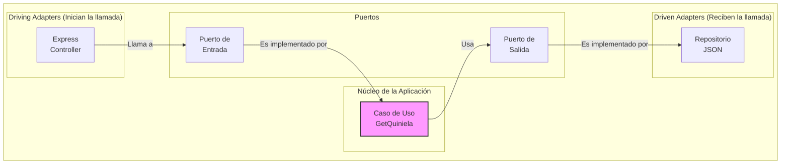

# 🔮 ¡La API de los Sueños y la Fortuna! 🔮

**[🚀 ¿Qué Hace Esta API?](#-qué-hace-esta-api) | [🎮 Cómo Usarla](#-cómo-usarla) | [🧑‍💻 Cómo Colaborar](#-cómo-colaborar)**

---

## 🚀 ¿Qué Hace Esta API?

¿Alguna vez te has preguntado qué significa soñar con un gato? 🐱 ¿Y si ese sueño fuera una señal?

Esta API es tu oráculo personal. Traduce tus sueños a números de la suerte o simplemente te da un número al azar para que tentes a la fortuna. ¡Juega, experimenta y descubre qué te depara el destino!

### Características Principales

✨ **Generador de Números Aleatorios:** ¿No sabes qué jugar? Te damos un número del 0 al 99 al azar.
🧠 **Intérprete de Sueños:** ¿Tienes un número en mente? Te decimos qué sueño representa.
🌎 **Soporte Multi-idioma:** Funciona en Español (`es`) e Inglés (`en`).
🤖 **Integración con n8n:** ¡Lista para automatizar tus corazonadas y probar la API sin código!

---

## 🎮 Cómo Usarla: Guía de Consumo

Aquí tienes todo lo que necesitas para empezar a consumir la API ahora mismo.

**Endpoint Principal:**

```
GET http://localhost:3000/
```

### Ejemplos Prácticos

**1. Petición Simple (Número Aleatorio en Español)**

> `GET /`

```json
{
  "status": "success",
  "data": {
    "number": 83,
    "meaning": "El mar - Viajes y cambios",
    "message": "Tu número de la quiniela es 83, y significa: El mar - Viajes y cambios."
  },
  "timestamp": "2023-10-27T18:00:00.000Z"
}
```

**2. Interpretando un Sueño (Número Específico)**

> `GET /?dream=25`

```json
{
  "status": "success",
  "data": {
    "number": 25,
    "meaning": "El gato - Misterio y suerte",
    "message": "Tu número de la quiniela es 25, y significa: El gato - Misterio y suerte."
  },
  "timestamp": "2023-10-27T18:01:00.000Z"
}
```

**3. Petición en Inglés**

> `GET /?lang=en&dream=42`

```json
{
  "status": "success",
  "data": {
    "number": 42,
    "meaning": "The fool - Unexpected changes",
    "message": "Your quiniela number is 42, and it means: The fool - Unexpected changes."
  },
  "timestamp": "2023-10-27T18:02:00.000Z"
}
```

**4. Cuando las Cosas Salen Mal (Errores de Validación)**

> `GET /?dream=101`

```json
{
  "status": "error",
  "errors": [
    "Invalid 'dream' parameter. It must be a number between 0 and 99."
  ],
  "timestamp": "2023-10-27T18:03:00.000Z"
}
```

### 🤖 Integración Mágica con n8n

Puedes probar toda esta API directamente en **n8n** sin escribir una sola línea de código. Hemos preparado un flujo de trabajo listo para importar con una suite de pruebas completa.

**¿Cómo importarlo?**

1. Abre el archivo [`n8n-quiniela-tests.json`](./n8n-quiniela-tests.json) que se encuentra en este proyecto y copia todo su contenido.
2. Ve a tu lienzo de n8n y simplemente presiona `Ctrl + V` (o `Cmd + V` en Mac).
3. ¡Listo! Los nodos aparecerán en tu pantalla, listos para que los explores y ejecutes.

> Para más detalles sobre cómo usar los nodos HTTP en n8n, puedes consultar la [documentación oficial de n8n](https://docs.n8n.io/courses/level-one/chapter-6/).

### 📖 Documentación Interactiva de la API (Swagger)

Para una referencia completa y la posibilidad de probar la API directamente desde tu navegador, hemos incluido documentación interactiva con Swagger.

Una vez que el servidor esté corriendo, puedes acceder a ella en la siguiente URL:

[http://localhost:3000/docs](http://localhost:3000/docs)

Desde allí, podrás ver todos los endpoints, sus parámetros y respuestas esperadas.

---

## 🧑‍💻 Cómo Colaborar: ¡Anímate a Jugar!

Este proyecto es parte de un "patio de juegos" de software. Es un espacio para experimentar, aprender y romper cosas sin miedo. Si tienes una idea, ¡adelante!

### La Arquitectura del Castillo 🏰

Para mantener el orden en nuestro patio de juegos, usamos una **Arquitectura Hexagonal** (también conocida como "Puertos y Adaptadores").

**¿Por qué?** Porque nos permite mantener nuestra lógica de negocio (el "tesoro" del castillo 💎) a salvo y completamente independiente de tecnologías externas como el framework web o las bases de datos.



### Desglose de las Capas

| Directorio           | Capa del Hexágono                       | ¿Qué hace? 🤔                                                                                                                    |
| :------------------- | :-------------------------------------- | :------------------------------------------------------------------------------------------------------------------------------- |
| `src/domain`         | **Dominio (El Tesoro)**                 | Contiene la lógica y modelos más puros del negocio. ¡Cero dependencias externas!                                                 |
| `src/application`    | **Aplicación (Los Guardianes)**         | Orquesta los casos de uso y define los "puertos" (interfaces/contratos) que el núcleo necesita para comunicarse con el exterior. |
| `src/infrastructure` | **Infraestructura (El Mundo Exterior)** | Implementa los "adaptadores". Aquí viven Express, el lector de JSON, y cualquier otra tecnología que interactúe con el núcleo.   |

### ¡Manos a la Obra!

1. **Clona el repositorio.**
2. **Navega a la carpeta del proyecto:** `cd src/node/orbaf/quiniela`
3. **Instala las dependencias:** `yarn install`
4. **Inicia el servidor de desarrollo:** `yarn dev`
5. **Ejecuta los tests:** `yarn test`

¡Y eso es todo! Siéntete libre de añadir nuevas funcionalidades, proponer cambios o simplemente... jugar.
